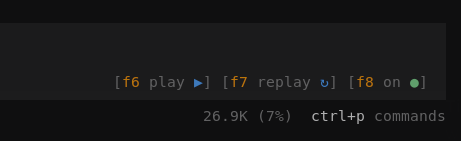

# @semirhuduti/opencode-tts-voice

Voice output plugin for OpenCode powered by Kokoro, with TUI shortcut support for controlling playback.



<a href="https://www.buymeacoffee.com/semirhuduti" target="_blank"></a>


## ALFA

Still wip, make sure to install sharp versions if you want a bit more reliability.

## Features

- reads assistant responses aloud while they stream in the TUI
- speaks question tool prompts from the active visible session
- adds TUI shortcuts for pause, replay latest response, and toggle on or off
- supports configurable voice, speed, model, precision, and playback settings
- uses local playback via `mpv`, `ffplay`, `paplay`, or `aplay`
- prefers GPU-capable execution when available and falls back to CPU automatically

## Requirements

- Linux, macOS, or Windows
- OpenCode with plugin support
- one of `mpv`, `ffplay`, `paplay`, or `aplay` available on the system. `mpv` is recommended.

Optional:

- CUDA and cuDNN runtime libraries for GPU execution

## Install

```bash
opencode plugin @semirhuduti/opencode-tts-voice --global
```

OpenCode loads the package automatically.

This package exposes a TUI plugin entrypoint and runs inside the OpenCode terminal UI.

Speech generation runs in a persistent helper process so Kokoro/ONNX work and WAV encoding do not block the TUI event loop.

## Recommended Agent Skill

This package includes a `tts-friendly-responses` agent skill that helps agents write responses that are easier to understand through speech playback. The runtime sanitizer still cleans up streamed text before playback, but the skill improves the source response by encouraging spoken-friendly prose instead of visually dense formatting.

Install the skill globally for OpenCode with the shared agent skills installer:

```bash
npx skills@latest add semirhuduti/opencode-tts-voice --skill tts-friendly-responses -g -a opencode
```

The plugin also includes a server entrypoint that loads this skill into each session's system context when the skill file exists and speech is enabled. Add the package to both OpenCode plugin configs if you want voice playback controls and automatic skill loading:

```json
{
  "plugin": ["@semirhuduti/opencode-tts-voice"]
}
```

Keep the TUI config shown below for the voice playback UI and shortcuts.

## Config

Example `~/.config/opencode/tui.json`:

```json
{
  "$schema": "https://opencode.ai/tui.json",
  "plugin": [
    [
      "@semirhuduti/opencode-tts-voice",
      {
        "voice": "am_adam",
        "speed": 1.1,
        "dtype": "q4",
        "speechBlocks": ["message", "idle"],
        "shortcuts": {
          "pause": "f6",
          "skipLatest": "f7",
          "toggle": "f8"
        }
      }
    ]
  ]
}
```

The plugin works with defaults, so the `shortcuts` block is optional unless you want custom keybinds.

If you install locally, OpenCode may write the plugin entry into your project `.opencode/tui.json` instead.

## Options

| Option | Type | Default | Description |
| --- | --- | --- | --- |
| `voice` | string | `af_heart` | Voice ID used for speech generation. |
| `speed` | number | `1` | Speech speed. Higher values are faster. |
| `device` | string | `auto` | Preferred execution device. Accepted values: `auto`, `cpu`, `cuda`, `dml`, `gpu`, `wasm`, `webgpu`. The plugin falls back to CPU automatically if the preferred backend cannot initialize. |
| `dtype` | string | `q8` | Model precision. Accepted values: `fp32`, `fp16`, `q4`, `q4f16`, `q8`. |
| `model` | string | `onnx-community/Kokoro-82M-v1.0-ONNX` | Model ID or compatible local model path. |
| `cacheDir` | string | Transformers.js default cache | Directory used for model downloads and cache data. |
| `audioPlayer` | string | `auto` | Playback backend command. `auto` picks the first installed backend from `ffplay`, `mpv`, `paplay`, or `aplay`. `mpv` is recommended. |
| `audioPlayerArgs` | string or string[] | `[]` | Additional arguments passed to the playback backend helper. |
| `speakResponses` | boolean | `true` | Speak streamed assistant responses. |
| `speakSubagentResponses` | boolean | `false` | Speak responses from subagent child sessions. Disabled by default so only the main agent is spoken. |
| `speakOnIdle` | boolean | `false` | Speak a message when the session becomes idle. |
| `speakQuestions` | boolean | `true` | Speak question tool prompts when they are asked in the active session. |
| `idleAnnouncement` | string | `Task completed.` | Idle announcement text. |
| `speechBlocks` | string[] | `["message", "idle"]` | Fine-grained speech source filter. Accepted values: `reason`, `message`, `idle`. Reasoning is opt-in. |
| `maxSpeechChunkChars` | number | `1000` | Maximum chunk size sent to the TTS generator. |
| `streamFlushChars` | number | `180` | Target flush size for streamed assistant text. |
| `maxSpeechChars` | number | `2000` | Maximum text length accepted for a single spoken chunk. |
| `fileExtensions` | string or string[] | `[]` | Additional alphanumeric file extensions recognized by speech sanitization. Extends the built-in list. |
| `trimSilenceThreshold` | number | `0.001` | Silence threshold used when trimming generated chunks. |
| `leadingAudioPadMs` | number | `12` | Leading padding preserved before detected speech. |
| `normalPauseMs` | number | `240` | Pause added after normal chunks. |
| `sentencePauseMs` | number | `420` | Pause added after sentence, clause, or newline-ending chunks. |
| `shortcuts.pause` | string | `f6` | TUI shortcut for play or pause. If audio is already playing, it pauses. If playback is idle, it replays the latest assistant response. |
| `shortcuts.skipLatest` | string | `f7` | TUI shortcut for replaying the latest assistant message in the active session. |
| `shortcuts.toggle` | string | `f8` | TUI shortcut for enabling or disabling automatic speech. |

## Logging

Runtime logging defaults to warnings and errors only to avoid terminal redraw pressure in the TUI. Enabled logs are also written beside OpenCode's own logs at `${XDG_DATA_HOME:-~/.local/share}/opencode/log/opencode-tts-voice-<timestamp>.log`. Set `OPENCODE_TTS_VOICE_LOG_LEVEL=debug` or `info` when diagnosing plugin behavior. Helper process logs are silent by default because stdout is used for the helper protocol; set `OPENCODE_TTS_VOICE_HELPER_LOG_LEVEL=warn` or `error` only when debugging helper startup failures.

## Shortcuts

Default TUI shortcuts:

- `f6`: play or pause speech
- `f7`: replay the latest assistant message
- `f8`: enable or disable speech

When the TUI entrypoint is active, the plugin also renders compact shortcut chips near the chat prompt. Each chip uses `[hotkey hint icon]` order and only shows controls that are useful for the current state:

- `[f8 off ○]` when speech is disabled
- `[f6 play ▶] [f7 replay ↻] [f8 on ●]` when speech is enabled and idle
- `⠋ [f6 pause Ⅱ] [f8 on ●]` while audio is generating, with the spinner animated and no `generating` text
- `[f6 pause Ⅱ] [f8 on ●]` while audio is playing
- `[f6 play ▶] [f7 replay ↻] [f8 on ●]` while paused
- `[! error] [f8 on ●]` or `[! error] [f8 off ○]` after a playback error
- shortcut keys are orange
- action icons are blue, except the toggle icon which is green for `on` and gray for `off`

`speechBlocks` works as a source filter on top of the speech toggles:

- `speakResponses` enables or disables streamed response playback
- `speakSubagentResponses` enables or disables speech from subagent child sessions
- `speakOnIdle` enables or disables idle announcements
- `speakQuestions` enables or disables question tool prompt playback for the active session only
- `speechBlocks` decides which of `reason`, `message`, and `idle` are allowed to be spoken when those features are active

Question prompt speech reads only the question text. It does not read answer options, descriptions, multi-select hints, or custom-answer instructions. Questions are governed by the global speech toggle and pause state, never spoken for subagent sessions, and queued behind any current playback.

Removed alpha option names are not accepted as aliases. Replace `playerBin` with `audioPlayer`, `playerArgs` with `audioPlayerArgs`, `readResponses` with `speakResponses`, `readSubagentResponses` with `speakSubagentResponses`, `announceOnIdle` with `speakOnIdle`, `idleMessage` with `idleAnnouncement`, `voiceBlocks` with `speechBlocks`, `speechChunkLength` with `maxSpeechChunkChars`, `streamSoftLimit` with `streamFlushChars`, `maxTextLength` with `maxSpeechChars`, `defaultChunkPauseMs` with `normalPauseMs`, and `clauseChunkPauseMs` with `sentencePauseMs`.

## Publish Notes

Published package entrypoints:

- `./tui`: TUI plugin entrypoint for OpenCode terminal UI

This package is intended to be published as a public scoped npm package.

## Playback Backends

Supported backends:

- `auto` (default)
- `mpv`
- `ffplay`
- `paplay`
- `aplay`

Example backend override:

```json
{
  "$schema": "https://opencode.ai/tui.json",
  "plugin": [
    [
      "@semirhuduti/opencode-tts-voice",
      {
        "audioPlayer": "mpv",
        "audioPlayerArgs": ["--volume=70"]
      }
    ]
  ]
}
```

## Voices

The plugin accepts Kokoro voice IDs. Common English voices include:

- `af_heart`
- `af_alloy`
- `af_aoede`
- `af_bella`
- `af_jessica`
- `af_kore`
- `af_nicole`
- `af_nova`
- `af_river`
- `af_sarah`
- `af_sky`
- `am_adam`
- `am_echo`
- `am_eric`
- `am_fenrir`
- `am_liam`
- `am_michael`
- `am_onyx`
- `am_puck`
- `am_santa`
- `bf_alice`
- `bf_emma`
- `bf_isabella`
- `bf_lily`
- `bm_daniel`
- `bm_fable`
- `bm_george`
- `bm_lewis`

`kokoro-js` ships additional voices beyond this list. If upstream adds new voices, you can usually use them directly through the `voice` option.
